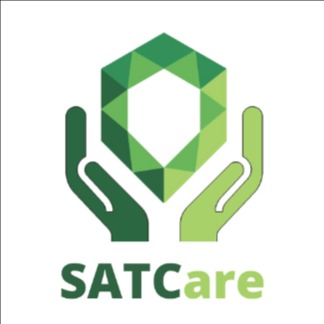

# SATCare

Backend do projeto satcare para as disciplinas de backend e projeto integrador

  

## Descrição do Projeto

SATCare é um webapp de agendamento de consultas odontológicas e psicológicas para funcionários da instituição SATC.
Com a possibilidade de agendar, cancelar e visualizar suas consultas, os funcionários poderão gerenciar
seus atendimentos com mais facilidade e comodidade.

## Integrantes
* ARTHUR DE LUCA HONORATO
* GUILHERME MACHADO DARABAS
* JULIANO CARDOSO FELIPE
* RUBENS SCOTTI JUNIOR
* STEPHAN ANTHONY MARQUES DOS SANTOS

## Regras de Negócio
* [x] Um funcionário não pode ter 2 ou mais agendamentos que conflitam em horário.
* [x] Agendamento só pode ser desmarcado com 3 dias de antecedencia.
* [x] Um cliente não pode ter agendamentos que conflitam horário.
* [x] No agendamento so pode conter serviços que o funcionário realiza.
* [x] Só pode ser realizar agendamento em datas futuras.
* [x] O agendamento só pode ser realizado em horarios que o funcionario trabalha.
* [x] Um servico nao pode ter valor menor que 0
* [x] Um servico nao pode ter tempo de atendimento menor que 0
* [x] Nao deve ser possivel cadastrar um agendamento sem data de inicio
* [x] O sistema deve calcular o horario de finalizacao do atendimento
* [x] O sistema deve calcular o valor total de um atendimento considerando todos servicos
