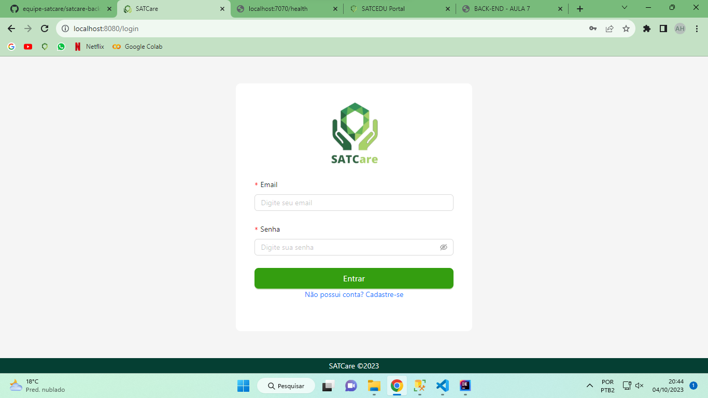
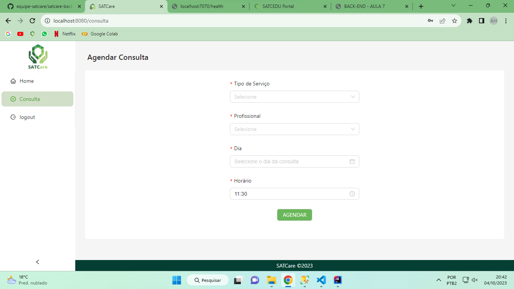
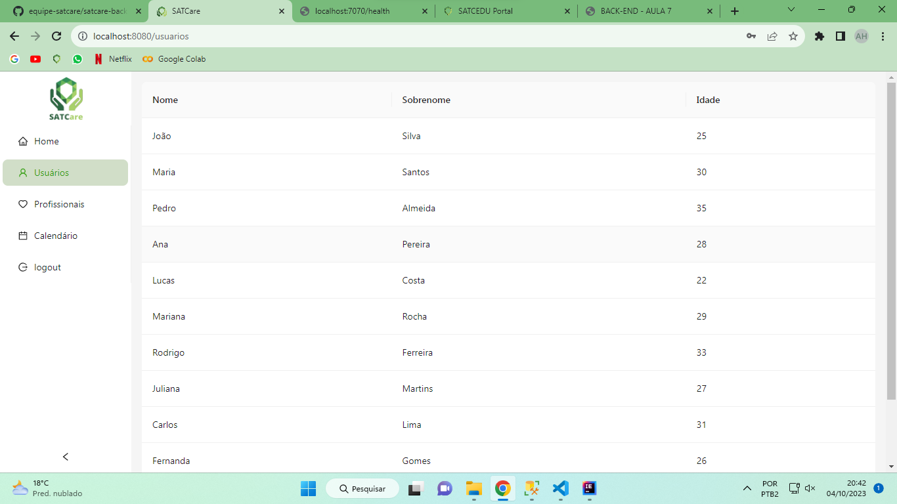
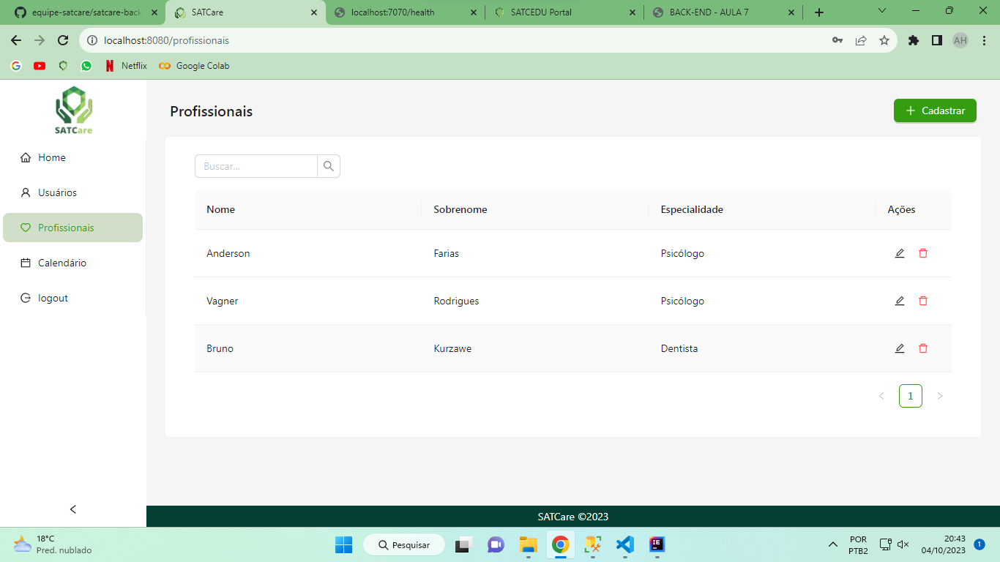
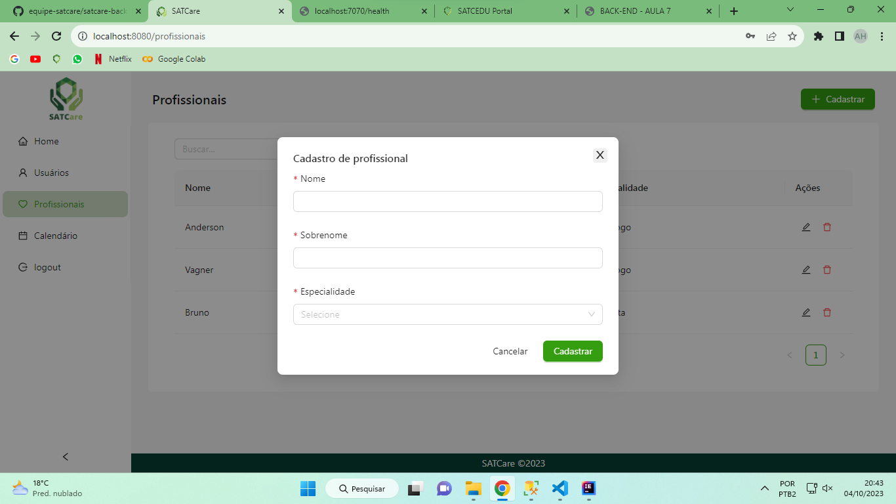

# SATCARE

  

## Regras de negócio
* 1 - Um funcionário não pode ter 2 ou mais agendamentos que conflitam em horário.
* 2 - Agendamento só pode ser desmarcado com 3 dias de antecedencia.
* 3 - Um cliente não pode ter agendamentos que conflitam horário.
* 4 - O agendamento só pode conter serviços que o funcionário realiza.
* 5 - Agendamentos e datas devem respeitar o fuso horário definido pela loja.
* 6 - Só pode ser realizado agendamento em horários definidos pela loja/fucionário.

## Tela de login

## Cadastro de consulta

## Listagem de usuarios

## Listagem de funcionários

## Cadastro de funcionário

